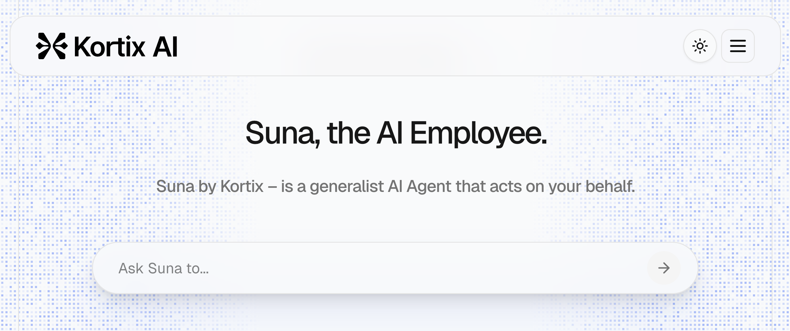

<div align="center">

# Suna - The Open Source generalist AI Agent that acts on your behalf.



Suna is a fully open source AI assistant that helps you accomplish real-world tasks with ease. Through natural conversation, Suna becomes your digital companion for research, data analysis, and everyday challenges—combining powerful capabilities with an intuitive interface that understands what you need and delivers results.

Suna's powerful toolkit includes seamless browser automation to navigate the web and extract data, file management for document creation and editing, web crawling and extended search capabilities, command-line execution for system tasks, website deployment, and integration with various APIs and services. These capabilities work together harmoniously, allowing Suna to solve your complex problems and automate workflows through simple conversations!
</div>

[](./license)
[](https://discord.gg/Py6pCBUUPw)
[](https://x.com/kortixai)
[](https://github.com/kortix-ai/agentpress)
[](https://github.com/kortix-ai/agentpress/labels/bug)


## Table of Contents

- [Suna Architecture](#project-architecture)
  - [Backend API](#backend-api)
  - [Frontend](#frontend)
  - [Agent Docker](#agent-docker)
  - [Supabase Database](#supabase-database)
- [Run Locally / Self-Hosting](#run-locally--self-hosting)
  - [Requirements](#requirements)
  - [Prerequisites](#prerequisites)
  - [Installation Steps](#installation-steps)
- [License](#license)

## Project Architecture


Suna consists of four main components:

### Backend API

The Backend API is built with Python and FastAPI, providing:

- **REST Endpoints**: Handles all communication between the frontend and agent system
- **Thread Management**: Manages conversation threads and maintains user context
- **LLM Integration**: Connects to OpenAI, Anthropic, and other providers via LiteLLM

### Frontend

The Frontend is built with Next.js and React, providing:

- **Modern UI**: Clean, responsive interface built with React and Tailwind CSS
- **Chat Interface**: Natural conversation interface with the AI agent
- **Dashboard**: Track and manage your tasks and agent interactions
- **Use Case Gallery**: Browse and learn from example Suna use cases
- **Real-time Updates**: Streaming responses and live agent status

### Agent Docker

The Agent Docker environment provides isolated execution for the AI agent:

- **Sandbox Environment**: Safely execute code and browse the web
- **Browser Automation**: Control Chrome for web interactions
- **Code Interpreter**: Python interpreter for data analysis and computation
- **File System Access**: Securely manage user files and resources
- **Tool Integration**: Connect to external APIs and services
- **Security**: Isolated container environment for safe execution

### Supabase Database

The Supabase Database provides data persistence and user management:
- **Authentication**: Secure API access and user verification
- **User Accounts**: Authentication and profile management
- **Conversation History**: Store and retrieve chat conversations
- **File Storage**: Manage user uploads and generated files
- **Agent State**: Persist agent state across sessions
- **Analytics**: Collect usage metrics and performance data
- **Real-time Subscriptions**: Live updates for collaborative features


## Run Locally / Self-Hosting

Suna can be self-hosted on your own infrastructure. Follow these steps to set up your own instance.

### Requirements

You'll need the following components:
- A Supabase project for database and authentication
- Redis database for caching and session management
- Daytona sandbox for secure agent execution
- Python 3.11 for the API backend
- API keys for LLM providers (OpenAI or Anthropic)
- (Optional but recommended) EXA API key for enhanced search capabilities

### Prerequisites

1. **Supabase**: 
   - Create a new [Supabase project](https://supabase.com/dashboard/projects)
   - Save your project's API URL, anon key, and service role key for later use
   - Install the [Supabase CLI](https://supabase.com/docs/guides/cli/getting-started)

2. **Redis**: Set up a Redis instance using one of these options:
   - [Upstash Redis](https://upstash.com/) (recommended for cloud deployments)
   - Local installation:
     - [Mac](https://formulae.brew.sh/formula/redis): `brew install redis`
     - [Linux](https://redis.io/docs/getting-started/installation/install-redis-on-linux/): Follow distribution-specific instructions
     - [Windows](https://redis.io/docs/getting-started/installation/install-redis-on-windows/): Use WSL2 or Docker
   - Save your Redis connection details for later use

3. **Daytona**: 
   - Create an account on [Daytona](https://www.daytona.io/)
   - Generate an API key from your account settings
   - Go to [Images](https://app.daytona.io/dashboard/images)
   - Click "Add Image"
   - Enter `adamcohenhillel/kortix-suna:0.0.13` as the image name
   - Set `exec /usr/bin/supervisord -n -c /etc/supervisor/conf.d/supervisord.conf` as the Entrypoint

4. **LLM API Keys**:
   - Obtain an API key from [OpenAI](https://platform.openai.com/) or [Anthropic](https://www.anthropic.com/)
   - While other providers should work via [LiteLLM](https://github.com/BerriAI/litellm), OpenAI and Anthropic are recommended

5. **Search API Key** (Optional):
   - For enhanced search capabilities, obtain an [Exa API key](https://dashboard.exa.ai/playground)

### Installation Steps

1. **Clone the repository**:
```bash
git clone https://github.com/kortix-ai/agentpress.git
cd agentpress
```

2. **Configure backend environment**:
```bash
cd backend
cp .env.example .env  # Create from example if available, or use the following template
```

Edit the `.env` file and fill in your credentials:
```bash
NEXT_PUBLIC_URL="http://localhost:3000"

# Supabase credentials from step 1
SUPABASE_URL=your_supabase_url
SUPABASE_ANON_KEY=your_supabase_anon_key
SUPABASE_SERVICE_ROLE_KEY=your_supabase_service_role_key

# Redis credentials from step 2
REDIS_HOST=your_redis_host
REDIS_PORT=6379
REDIS_PASSWORD=your_redis_password
REDIS_SSL=True  # Set to False for local Redis without SSL

# Daytona credentials from step 3
DAYTONA_API_KEY=your_daytona_api_key
DAYTONA_SERVER_URL="https://app.daytona.io/api"
DAYTONA_TARGET="us"

# Anthropic or OpenAI: 
# Anthropic
ANTHROPIC_API_KEY=
MODEL_TO_USE="anthropic/claude-3-7-sonnet-latest"

# OR OpenAI API:
OPENAI_API_KEY=your_openai_api_key
MODEL_TO_USE="gpt-4o"

# Optional but recommended
EXA_API_KEY=your_exa_api_key  # Optional
```

3. **Set up Supabase database**:
```bash
# Login to Supabase CLI
supabase login

# Link to your project (find your project reference in the Supabase dashboard)
supabase link --project-ref your_project_reference_id

# Push database migrations
supabase db push
```

4. **Configure frontend environment**:
```bash
cd ../frontend
cp .env.example .env.local  # Create from example if available, or use the following template
```

   Edit the `.env.local` file:
```
NEXT_PUBLIC_SUPABASE_URL=your_supabase_url
NEXT_PUBLIC_SUPABASE_ANON_KEY=your_supabase_anon_key
NEXT_PUBLIC_BACKEND_URL="http://localhost:8000/api"
NEXT_PUBLIC_URL="http://localhost:3000"
```

5. **Install dependencies**:
```bash
# Install frontend dependencies
cd frontend
npm install

# Install backend dependencies
cd ../backend
pip install -r requirements.txt
```

6. **Start the application**:

   In one terminal, start the frontend:
```bash
cd frontend
npm run dev
```

   In another terminal, start the backend:
```bash
cd backend
python api.py
```

7. **Access Suna**:
   - Open your browser and navigate to `http://localhost:3000`
   - Sign up for an account using the Supabase authentication
   - Start using your self-hosted Suna instance!

## License

Kortix Suna is licensed under the Apache License, Version 2.0. See [LICENSE](./LICENSE) for the full license text.