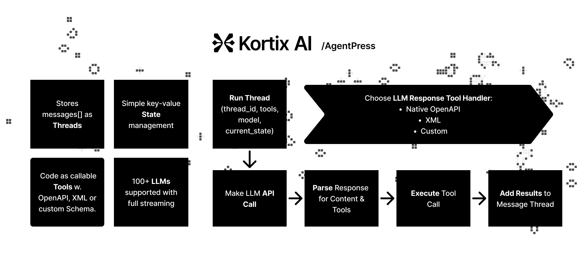

# AgentPress: Building Blocks for AI Agents

AgentPress is a collection of _simple, but powerful_ utilities that serve as building blocks for creating AI agents. *Plug, play, and customize.*



See [How It Works](#how-it-works) for an explanation of this flow.

## Core Components
- **Threads**: Manage Messages[] as threads.
- **Tools**: Register code as callable tools with definitions in both OpenAPI and XML
- **Response Processing**: Support for native-LLM OpenAPI and XML-based tool calling
- **State Management**: Thread-safe JSON key-value state management
- **LLM**: +100 LLMs using the OpenAI I/O Format powered by LiteLLM

## Installation & Setup

1. Install the package:
```bash
pip install agentpress
```

2. Initialize AgentPress in your project:
```bash
agentpress init
```
Creates a `agentpress` directory with all the core utilities.
Check out [File Overview](#file-overview) for explanations of the generated files.

3. If you selected the example agent during initialization:
   - Creates an `agent.py` file with a web development agent example
   - Creates a `tools` directory with example tools:
     - `files_tool.py`: File operations (create/update files, read directory and load into state)
     - `terminal_tool.py`: Terminal command execution
   - Creates a `workspace` directory for the agent to work in


## Quick Start

1. Set up your environment variables in a `.env` file:
```bash
OPENAI_API_KEY=your_key_here
ANTHROPIC_API_KEY=your_key_here
GROQ_API_KEY=your_key_here
```

2. Create a calculator tool with OpenAPI schema:
```python
from agentpress.tool import Tool, ToolResult, openapi_schema

class CalculatorTool(Tool):
    @openapi_schema({
        "type": "function",
        "function": {
            "name": "add",
            "description": "Add two numbers",
            "parameters": {
                "type": "object",
                "properties": {
                    "a": {"type": "number"},
                    "b": {"type": "number"}
                },
                "required": ["a", "b"]
            }
        }
    })
    async def add(self, a: float, b: float) -> ToolResult:
        try:
            result = a + b
            return self.success_response(f"The sum is {result}")
        except Exception as e:
            return self.fail_response(f"Failed to add numbers: {str(e)}")
```

3. Or create a tool with XML schema:
```python
from agentpress.tool import Tool, ToolResult, xml_schema

class FilesTool(Tool):
    @xml_schema(
        tag_name="create-file",
        mappings=[
            {"param_name": "file_path", "node_type": "attribute", "path": "."},
            {"param_name": "file_contents", "node_type": "content", "path": "."}
        ],
        example='''
        <create-file file_path="path/to/file">
        File contents go here
        </create-file>
        '''
    )
    async def create_file(self, file_path: str, file_contents: str) -> ToolResult:
        # Implementation here
        pass
```

4. Use the Thread Manager with streaming and tool execution:
```python
import asyncio
from agentpress.thread_manager import ThreadManager
from calculator_tool import CalculatorTool

async def main():
    # Initialize thread manager and add tools
    manager = ThreadManager()
    manager.add_tool(CalculatorTool)

    # Create a new thread
    thread_id = await manager.create_thread()
    
    # Add your message
    await manager.add_message(thread_id, {
        "role": "user", 
        "content": "What's 2 + 2?"
    })
    
    # Run with streaming and tool execution
    response = await manager.run_thread(
        thread_id=thread_id,
        system_message={
            "role": "system", 
            "content": "You are a helpful assistant with calculation abilities."
        },
        model_name="anthropic/claude-3-5-sonnet-latest",
        stream=True,
        native_tool_calling=True,
        execute_tools=True,
        execute_tools_on_stream=True
    )

    # Handle streaming response
    if isinstance(response, AsyncGenerator):
        async for chunk in response:
            if hasattr(chunk.choices[0], 'delta'):
                delta = chunk.choices[0].delta
                if hasattr(delta, 'content') and delta.content:
                    print(delta.content, end='', flush=True)

asyncio.run(main())
```

5. View conversation threads in a web UI:
```bash
streamlit run agentpress/thread_viewer_ui.py
```

## How It Works

Each AI agent iteration follows a clear, modular flow:

1. **Message & LLM Handling**
   - Messages are managed in threads via `ThreadManager`
   - LLM API calls are made through a unified interface (`llm.py`)
   - Supports streaming responses for real-time interaction

2. **Response Processing**
   - LLM returns both content and tool calls
   - Content is streamed in real-time
   - Tool calls are parsed using either:
     - Standard OpenAPI function calling
     - XML-based tool definitions
     - Custom parsers (extend `ToolParserBase`)

3. **Tool Execution**
   - Tools are executed either:
     - In real-time during streaming (`execute_tools_on_stream`)
     - After complete response
     - In parallel or sequential order
   - Supports both standard and XML tool formats
   - Extensible through `ToolExecutorBase`

4. **Results Management**
   - Results from both content and tool executions are handled
   - Supports different result formats (standard/XML)
   - Customizable through `ResultsAdderBase`

This modular architecture allows you to:
- Use standard OpenAPI function calling
- Switch to XML-based tool definitions
- Create custom processors by extending base classes
- Mix and match different approaches

## File Overview

### Core Components

#### agentpress/llm.py
LLM API interface using LiteLLM. Supports 100+ LLMs with OpenAI-compatible format. Includes streaming, retry logic, and error handling.

#### agentpress/thread_manager.py
Manages conversation threads with support for:
- Message history management
- Tool registration and execution
- Streaming responses
- Both OpenAPI and XML tool calling patterns

#### agentpress/tool.py
Base infrastructure for tools with:
- OpenAPI schema decorator for standard function calling
- XML schema decorator for XML-based tool calls
- Standardized ToolResult responses

#### agentpress/tool_registry.py
Central registry for tool management:
- Registers both OpenAPI and XML tools
- Maintains tool schemas and implementations
- Provides tool lookup and validation

#### agentpress/state_manager.py
Thread-safe state persistence:
- JSON-based key-value storage
- Atomic operations with locking
- Automatic file handling

### Response Processing

#### agentpress/llm_response_processor.py
Handles LLM response processing with support for:
- Streaming and complete responses
- Tool call extraction and execution
- Result formatting and message management

#### Standard Processing
- `standard_tool_parser.py`: Parses OpenAPI function calls
- `standard_tool_executor.py`: Executes standard tool calls
- `standard_results_adder.py`: Manages standard results

#### XML Processing
- `xml_tool_parser.py`: Parses XML-formatted tool calls
- `xml_tool_executor.py`: Executes XML tool calls
- `xml_results_adder.py`: Manages XML results

## Philosophy
- **Plug & Play**: Start with our defaults, then customize to your needs.
- **Agnostic**: Built on LiteLLM, supporting any LLM provider. Minimal opinions, maximum flexibility.
- **Simplicity**: Clean, readable code that's easy to understand and modify.
- **No Lock-in**: Take full ownership of the code. Copy what you need directly into your codebase.

## Contributing

We welcome contributions! Feel free to:
- Submit issues for bugs or suggestions
- Fork the repository and send pull requests
- Share how you've used AgentPress in your projects

## Development

1. Clone:
```bash
git clone https://github.com/kortix-ai/agentpress
cd agentpress
```

2. Install dependencies:
```bash
pip install poetry
poetry install
```

3. For quick testing:
```bash
pip install -e .
```

## License

[MIT License](LICENSE)

Built with ❤️ by [Kortix AI Corp](https://kortix.ai)