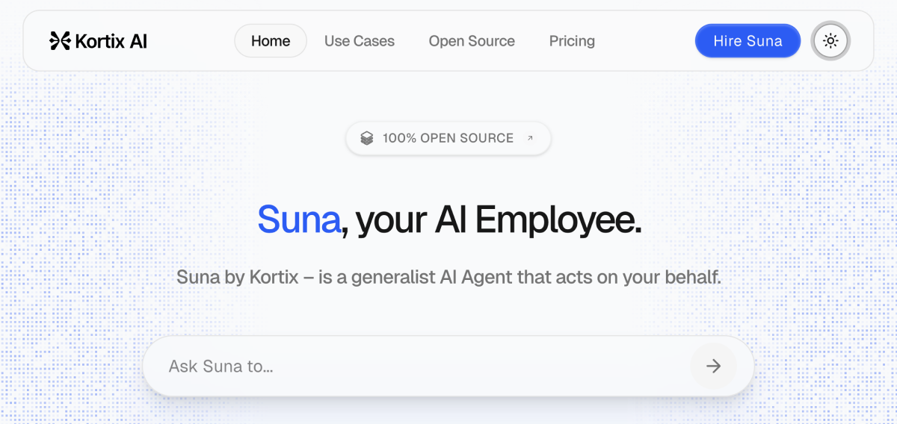
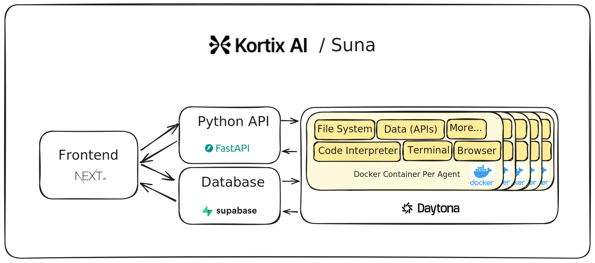

<div align="center">

# Suna - Open Source Generalist AI Agent

(that acts on your behalf)



Suna is a fully open source AI assistant that helps you accomplish real-world tasks with ease. Through natural conversation, Suna becomes your digital companion for research, data analysis, and everyday challenges—combining powerful capabilities with an intuitive interface that understands what you need and delivers results.

Suna's powerful toolkit includes seamless browser automation to navigate the web and extract data, file management for document creation and editing, web crawling and extended search capabilities, command-line execution for system tasks, website deployment, and integration with various APIs and services. These capabilities work together harmoniously, allowing Suna to solve your complex problems and automate workflows through simple conversations!

[](./license)
[](https://discord.gg/Py6pCBUUPw)
[](https://x.com/kortixai)
[](https://github.com/kortix-ai/suna)
[](https://github.com/kortix-ai/suna/labels/bug)
</div>


## Table of Contents

- [Suna Architecture](#project-architecture)
  - [Backend API](#backend-api)
  - [Frontend](#frontend)
  - [Agent Docker](#agent-docker)
  - [Supabase Database](#supabase-database)
- [Run Locally / Self-Hosting](#run-locally--self-hosting)
  - [Requirements](#requirements)
  - [Prerequisites](#prerequisites)
  - [Installation Steps](#installation-steps)
- [License](#license)

## Project Architecture



Suna consists of four main components:

### Backend API
Python/FastAPI service that handles REST endpoints, thread management, and LLM integration with OpenAI, Anthropic, and others via LiteLLM.

### Frontend
Next.js/React application providing a responsive UI with chat interface, dashboard, etc.

### Agent Docker
Isolated execution environment for every agent - with browser automation, code interpreter, file system access, tool integration, and security features.

### Supabase Database
Handles data persistence with authentication, user management, conversation history, file storage, agent state, analytics, and real-time subscriptions.

## Use Cases

1. **Competitor Analysis** ([Watch](https://suna.so/use-case/competitor-analysis)) - *"Analyze the market for my next company in the healthcare industry, located in the UK. Give me the major players, their market size, strengths, and weaknesses, and add their website URLs. Once done, generate a PDF report."*

2. **VC List** ([Watch](https://suna.so/use-case/vc-list)) - *"Give me the list of the most important VC Funds in the United States based on Assets Under Management. Give me website URLs, and if possible an email to reach them out."*

3. **Insurance Policies** ([Watch](https://suna.so/use-case/insurance-policies)) - *"Find me the best insurance policy per pricing for my house, located in Milan, Italy. Scrape Italian companies in the insurance market for houses."*

4. **Looking for Candidates** ([Watch](https://suna.so/use-case/looking-for-candidates)) - *"Go on LinkedIn, and find me 10 profiles available - they are not working right now - for a junior software engineer position, who are located in Munich, Germany. They should have at least one bachelor's degree in Computer Science or anything related to it, and 1-year of experience in any field/role."*

5. **Writing Report** ([Watch](https://suna.so/use-case/writing-report)) - *"Write me a detailed report about what's happened in the US stock market in the last 2 weeks. Analyze the S&P 500 trend, and tell me what the market is expecting to see in the upcoming weeks. This is a report analysis for a Bank CFO."*

6. **Product Reviews** ([Watch](https://suna.so/use-case/product-reviews)) - *"Go on Amazon, and find me the most common product issues related to the Nespresso Machine - you can find them by reading the reviews. Once done, write me a short report about common issues that could be converted into competitive advantage for a new Nespresso Machine."*

7. **Game Generation** ([Watch](https://suna.so/use-case/game-generation)) - *"Generate a Mini Game where the Player needs to drive a spaceship and fight against interstellar aliens. The aliens should be green, while the main player should be white. Make it with a 90' style."*

8. **Planning Company Trip** ([Watch](https://suna.so/use-case/planning-company-trip)) - *"Generate me a route plan for my company. We should go to California. We'll be in 8 people. Compose the trip from the departure (Paris, France) to the activities we can do considering that the trip will be 7 days long - departure on the 21st of Apr 2025. Check the weather forecast and temperature for the upcoming days, and based on that, you can plan our activities (outdoor vs indoor)."*

9. **Working on Excel** ([Watch](https://suna.so/use-case/working-on-excel)) - *"My company asked me to set up an Excel spreadsheet with all the information about Italian lottery games (Lotto, 10eLotto, and Million Day). Based on that, generate and send me a spreadsheet with all the basic information (public ones)."*

10. **Scraping Databases** ([Watch](https://suna.so/use-case/scraping-databases)) - *"Search for open tender databases (e.g. EU TED, US SAM.gov), find relevant procurement calls in the clean tech industry, summarize requirements, and generate a report about it."*

11. **Automate Event Speaker Prospecting** ([Watch](https://suna.so/use-case/automate-event-speaker-prospecting)) - *"Find 20 AI ethics speakers from Europe who've spoken at conferences in the past year. Scrapes conference sites, cross-references LinkedIn and YouTube, and outputs contact info + talk summaries."*

12. **Summarize and Cross-Reference Scientific Papers** ([Watch](https://suna.so/use-case/summarize-cross-reference-scientific-papers)) - *"Research and compare scientific papers talking about Alcohol effects on our bodies during the last 5 years. Generate a report about the most important scientific papers talking about the topic I wrote before."*

13. **Generating Leads** ([Watch](https://suna.so/use-case/generating-leads)) - *"I need to generate at least 20 B2B leads to reach out for my new AI tool. It's a customer support tool, then I'll need to have companies located in Spain, Barcelona, with 10-50 employees (find a way to get the number of employees). List me their names, websites, size (employees), and contact information if public."*

14. **Research + First Contact Draft** ([Watch](https://suna.so/use-case/research-first-contact-draft)) - *"Research my potential customers (B2B) on LinkedIn. They should be in the clean tech industry. Find their websites and their email addresses. After that, based on the company profile, generate a personalized first contact email where I present my company which is offering consulting services to cleantech companies to maximize their profits and reduce their costs."*

15. **SEO Analysis** ([Watch](https://suna.so/use-case/seo-analysis)) - *"Based on my website suna.so, generate an SEO report analysis, find top-ranking pages by keyword clusters, and identify topics I'm missing."*

16. **Clustering Public Reviews** ([Watch](https://suna.so/use-case/clustering-public-reviews)) - *"Clusterize public reviews for McDonald's by scraping them on public pages like Google Reviews, then generate a detailed report about the most common feedback and reviews (from 5 to 1 star), generate cluster to obtain insights about what can be improved and what is producing good results for the McDonald's brand."*

17. **Generate a Personal Trip** ([Watch](https://suna.so/use-case/generate-personal-trip)) - *"Generate a personal trip to London, with departure from Bangkok on the 1st of May. The trip will last 10 days. Find an accommodation in the center of London, with a rating on Google reviews of at least 4.5. Find me interesting outdoor activities to do during the journey. Generate a detailed itinerary plan."*

18. **Scrape and Monitor Stocks** ([Watch](https://suna.so/use-case/scrape-monitor-stocks)) - *"I want to monitor the 10 biggest public companies in Portugal. Scrape them on the internet, and find the public ones with the price/share available in the last 30 trading days. Generate a report based on the data you find."*

19. **Recently Funded Startups** ([Watch](https://suna.so/use-case/recently-funded-startups)) - *"Go on Crunchbase, Dealroom, and TechCrunch, filter by Series A funding rounds in the SaaS Finance Space, and build a report with company data, founders, and contact info for outbound sales."*

20. **Scrape Forum Discussions** ([Watch](https://suna.so/use-case/scrape-forum-discussions)) - *"I need to find the best beauty centers in Rome, but I want to find them by using open forums that speak about this topic. Go on Google, and scrape the forums by looking for beauty center discussions located in Rome. Then generate a list of 5 beauty centers with the best comments about them."*

## Run Locally / Self-Hosting

Suna can be self-hosted on your own infrastructure. Follow these steps to set up your own instance.

### Requirements

You'll need the following components:
- A Supabase project for database and authentication
- Redis database for caching and session management
- Daytona sandbox for secure agent execution
- Python 3.11 for the API backend
- API keys for LLM providers (OpenAI or Anthropic)
- (Optional but recommended) EXA API key for enhanced search capabilities

### Prerequisites

1. **Supabase**: 
   - Create a new [Supabase project](https://supabase.com/dashboard/projects)
   - Save your project's API URL, anon key, and service role key for later use
   - Install the [Supabase CLI](https://supabase.com/docs/guides/cli/getting-started)

2. **Redis**: Set up a Redis instance using one of these options:
   - [Upstash Redis](https://upstash.com/) (recommended for cloud deployments)
   - Local installation:
     - [Mac](https://formulae.brew.sh/formula/redis): `brew install redis`
     - [Linux](https://redis.io/docs/getting-started/installation/install-redis-on-linux/): Follow distribution-specific instructions
     - [Windows](https://redis.io/docs/getting-started/installation/install-redis-on-windows/): Use WSL2 or Docker
   - Save your Redis connection details for later use

3. **Daytona**: 
   - Create an account on [Daytona](https://www.daytona.io/)
   - Generate an API key from your account settings
   - Go to [Images](https://app.daytona.io/dashboard/images)
   - Click "Add Image"
   - Enter `adamcohenhillel/kortix-suna:0.0.13` as the image name
   - Set `exec /usr/bin/supervisord -n -c /etc/supervisor/conf.d/supervisord.conf` as the Entrypoint

4. **LLM API Keys**:
   - Obtain an API key from [OpenAI](https://platform.openai.com/) or [Anthropic](https://www.anthropic.com/)
   - While other providers should work via [LiteLLM](https://github.com/BerriAI/litellm), OpenAI and Anthropic are recommended

5. **Search API Key** (Optional):
   - For enhanced search capabilities, obtain an [Exa API key](https://dashboard.exa.ai/playground)
  
6. **RapidAPI API Key** (Optional):
   - To enable API services like LinkedIn, and others, you'll need a RapidAPI key
   - Each service requires individual activation in your RapidAPI account:
     1. Locate the service's `base_url` in its corresponding file (e.g., `"https://linkedin-data-scraper.p.rapidapi.com"` in [`backend/agent/tools/data_providers/LinkedinProvider.py`](backend/agent/tools/data_providers/LinkedinProvider.py))
     2. Visit that specific API on the RapidAPI marketplace
     3. Subscribe to the service (many offer free tiers with limited requests)
     4. Once subscribed, the service will be available to your agent through the API Services tool

### Installation Steps

1. **Clone the repository**:
```bash
git clone https://github.com/kortix-ai/suna.git
cd suna
```

2. **Configure backend environment**:
```bash
cd backend
cp .env.example .env  # Create from example if available, or use the following template
```

Edit the `.env` file and fill in your credentials:
```bash
NEXT_PUBLIC_URL="http://localhost:3000"

# Supabase credentials from step 1
SUPABASE_URL=your_supabase_url
SUPABASE_ANON_KEY=your_supabase_anon_key
SUPABASE_SERVICE_ROLE_KEY=your_supabase_service_role_key

# Redis credentials from step 2
REDIS_HOST=your_redis_host
REDIS_PORT=6379
REDIS_PASSWORD=your_redis_password
REDIS_SSL=True  # Set to False for local Redis without SSL

# Daytona credentials from step 3
DAYTONA_API_KEY=your_daytona_api_key
DAYTONA_SERVER_URL="https://app.daytona.io/api"
DAYTONA_TARGET="us"

# Anthropic or OpenAI: 
# Anthropic
ANTHROPIC_API_KEY=
MODEL_TO_USE="anthropic/claude-3-7-sonnet-latest"

# OR OpenAI API:
OPENAI_API_KEY=your_openai_api_key
MODEL_TO_USE="gpt-4o"

# Optional but recommended
EXA_API_KEY=your_exa_api_key  # Optional
RAPID_API_KEY=
```

3. **Set up Supabase database**:
```bash
# Login to Supabase CLI
supabase login

# Link to your project (find your project reference in the Supabase dashboard)
supabase link --project-ref your_project_reference_id

# Push database migrations
supabase db push
```

4. **Configure frontend environment**:
```bash
cd ../frontend
cp .env.example .env.local  # Create from example if available, or use the following template
```

   Edit the `.env.local` file:
```
NEXT_PUBLIC_SUPABASE_URL=your_supabase_url
NEXT_PUBLIC_SUPABASE_ANON_KEY=your_supabase_anon_key
NEXT_PUBLIC_BACKEND_URL="http://localhost:8000/api"
NEXT_PUBLIC_URL="http://localhost:3000"
```

5. **Install dependencies**:
```bash
# Install frontend dependencies
cd frontend
npm install

# Install backend dependencies
cd ../backend
pip install -r requirements.txt
```

6. **Start the application**:

   In one terminal, start the frontend:
```bash
cd frontend
npm run dev
```

   In another terminal, start the backend:
```bash
cd backend
python api.py
```

7. **Access Suna**:
   - Open your browser and navigate to `http://localhost:3000`
   - Sign up for an account using the Supabase authentication
   - Start using your self-hosted Suna instance!

## License

Kortix Suna is licensed under the Apache License, Version 2.0. See [LICENSE](./LICENSE) for the full license text.
